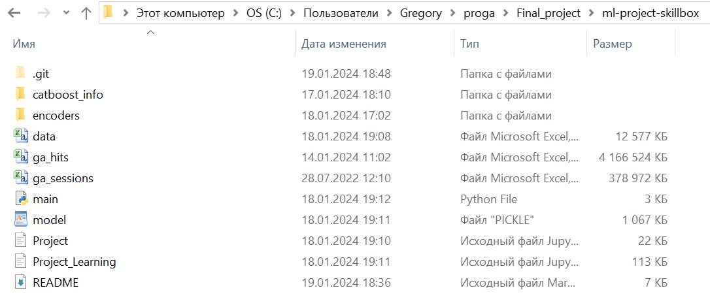
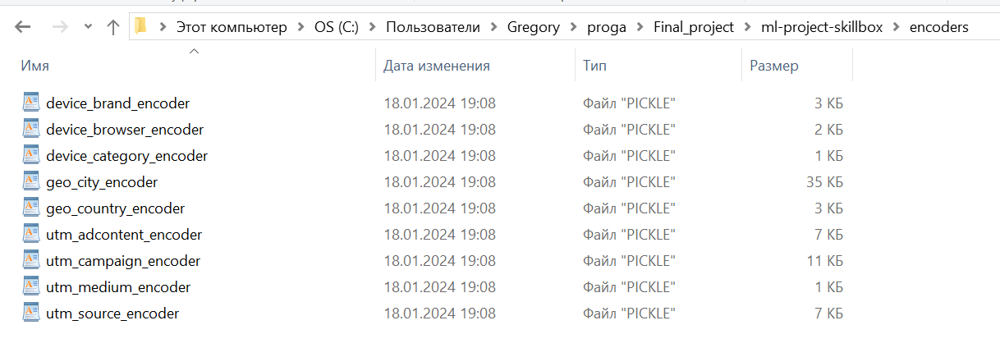
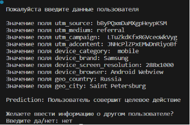

# ML Project Skillbox

## Финальная работа ML:  Анализ сайта «СберАвтоподписка»

Выполнил: Бондаренко Григорий Александрович
Группа: АД-ОБ-2023
Дата: январь 2024 г.

# Файлы проекта:
## Папка notebooks:
Project.ipynb - чистка, обработка и анализ данных;
Project_Learning.ipynb - обучение модели.
## Папка src:
main.py - код запуска модели.
## Папка data (имеется в оригинальном GitLab: https://gitlab.skillbox.ru/grigorii_bondarenko/ml-project-skillbox):
data.csv - очищенные данные (после работы файла Project.ipynb);
ga_sessions.csv - входные данные (первоначальные данные);
ga_hits.csv - входные данные (первоначальные данные).
## Папка model:
model.pickle - данные после обучения модели.
## Папка encoders:
файлы с сохраненными словарями кодировки словесной информации.
## Папка catboost_info:
библиотека catboost.

## Ход работы (инструкция по запуску)

Загрузить все файлы и сохранить их в одну папку

Создать папку “encoders” и проконтролировать сохранение в неё словарей с кодировкой словесной информации (словари сохранятся после запуска файла “Project.ipynb”) 

Запустить файл с чисткой (Project.ipynb)

Запустить файл с обучением модели (Project_Learning.ipynb)

Проконтролировать создание файла “model.pickle”

Запустить файл с запуском модели (“main.py”)

Поочередно вводите данные, которые у вас запрашивает программа 
(Внимание! Поле “device_screen_resolution” необходимо заполнить через английский символ “x”)

# Конец
