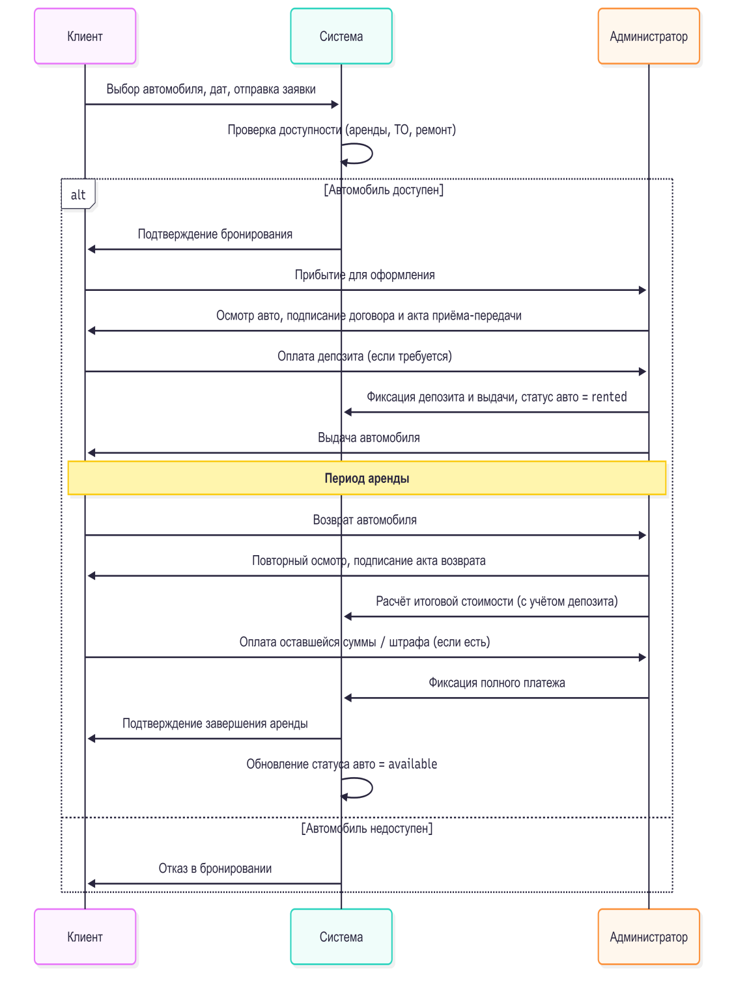
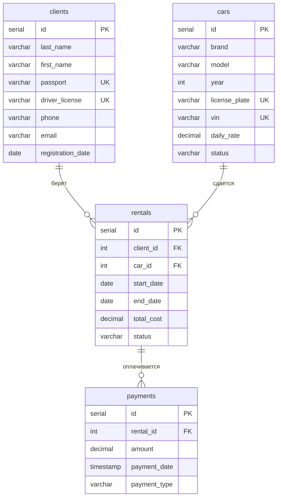

# База данных сервиса аренды автомобилей

Курсовая по дисциплине «Базы данных», 3 курс, декабрь 2025. Макет БД для небольшого проката: клиенты, автомобили, аренды и платежи, плюс запросы и представления под разные роли сотрудников

## Процесс, который автоматизирует база

Клиент выбирает машину и даты, система проверяет доступность, администратор оформляет договор и принимает депозит, после возврата считается итоговая стоимость и машина снова становится свободной



## Схема

Четыре таблицы в третьей нормальной форме. Статусы машин, аренд и типов платежей ограничены через `CHECK`, даты аренды проверяются на `end_date > start_date`. Индексы построены по внешним ключам и датам аренды, по ним идут проверка доступности и все отчёты



## Что есть в запросах

`03_queries.sql` покрывает типовые сценарии: свободные машины эконом-класса на дату (через `NOT EXISTS`), проверка конкретной модели, помесячная выручка и средняя длительность аренды, список текущих аренд, обновление контактов клиента, параметризованный поиск через `PREPARE` и сезонность по месяцам со `STRING_AGG` по маркам

`04_views.sql` создаёт три представления:

- `manager_rentals_view` для менеджеров: текущие аренды с телефоном клиента
- `finance_payments_view` для бухгалтерии: платежи без персональных данных
- `client_analysis_view` для CRM: число аренд и сумма трат по каждому клиенту

В `05_view_queries.sql` поверх них сегментация клиентов (новый, постоянный, VIP) и сверка оплат со стоимостью аренд

## Запуск

```bash
createdb car_rental_db
cd sql
for f in 01_schema.sql 02_seed.sql 03_queries.sql 04_views.sql 05_view_queries.sql; do
    psql -d car_rental_db -f "$f"
done
```

Все персональные данные в наполнении выдуманные

Инструменты: PostgreSQL, pgAdmin 4, dbdiagram.io. Текст курсовой, презентация и справка о проверке на заимствования лежат в [`reports/`](reports)
