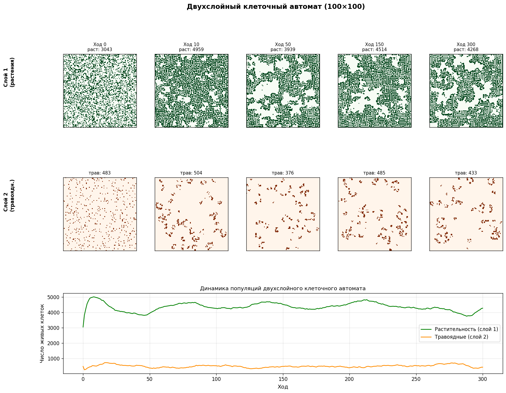
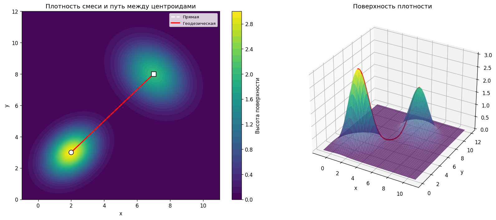
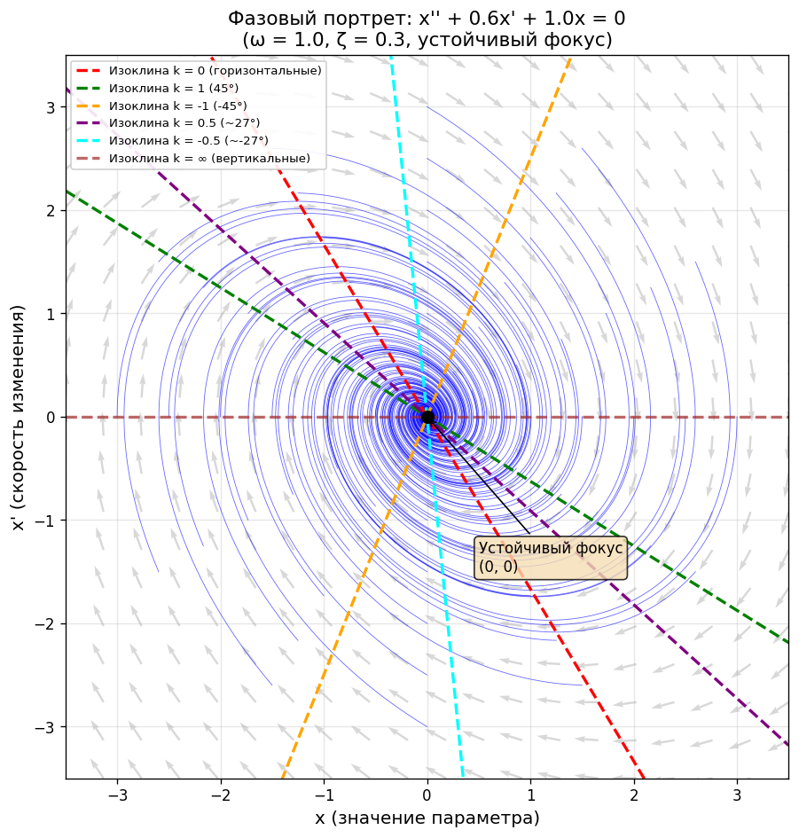

# Лабораторные по машинному обучению

14 работ по дисциплине «Машинное обучение» за 2-3 курс (2025): контрольные, обязательные и творческие задания. Несмотря на название дисциплины, большая часть задач ближе к численным методам и моделированию: расстояния между распределениями, клеточные автоматы, динамические системы, оптимизация

У каждой работы своя папка со скриптом, картинкой результата и README с условием и выводами

<table>
<tr>
<td><a href="lab_predator_prey_automaton"></a></td>
<td><a href="lab_geodesic_cluster_distance"></a></td>
<td><a href="lab_phase_portrait_second_order"></a></td>
</tr>
<tr>
<td align="center">Растительность и травоядные</td>
<td align="center">Геодезическая по плотности</td>
<td align="center">Фазовый портрет</td>
</tr>
</table>

## Все работы

| Папка | Тема | Тип |
|---|---|---|
| [lab_recursive_least_squares](./lab_recursive_least_squares) | Рекуррентный МНК: уточнение прямой при поступлении новых точек | КР №1 |
| [lab_minkowski_norm_fitting](./lab_minkowski_norm_fitting) | Прямая, минимизирующая невязку по Минковскому, устойчивость к выбросу | КР №3 |
| [lab_random_walk_distribution](./lab_random_walk_distribution) | Распределение положения при случайном блуждании | Обязательное №1a |
| [lab_geodesic_cluster_distance](./lab_geodesic_cluster_distance) | Геодезическое расстояние между кластерами по поверхности плотности | Обязательное №1b |
| [lab_cluster_distance_wasserstein](./lab_cluster_distance_wasserstein) | Матрица расстояний Вассерштейна между кластерами | КР №2 |
| [lab_mahalanobis_distance](./lab_mahalanobis_distance) | Расстояние Махаланобиса от точки до кластеров, вырожденная ковариация | Обязательное №2b |
| [lab_game_of_life_torus](./lab_game_of_life_torus) | Игра «Жизнь» на торе 100×100 | Обязательное №2a |
| [lab_cellular_automaton_conservation](./lab_cellular_automaton_conservation) | Клеточный автомат с сохранением суммарной «массы» | Творческое №2 |
| [lab_predator_prey_automaton](./lab_predator_prey_automaton) | Двухслойный автомат «растительность и травоядные» | Творческое №3 |
| [lab_pricing_under_uncertainty](./lab_pricing_under_uncertainty) | Цена при случайном спросе: средний доход против надёжности | Обязательное №3a |
| [lab_first_order_system_control](./lab_first_order_system_control) | Апериодическое звено и П-регулятор, стационарная ошибка | Обязательное №3b |
| [lab_projectile_motion_drag](./lab_projectile_motion_drag) | Оптимальный угол выстрела с сопротивлением воздуха | Обязательное №4a |
| [lab_phase_portrait_second_order](./lab_phase_portrait_second_order) | Фазовый портрет системы 2-го порядка, изоклины | Обязательное №4b |
| [lab_phase_portrait_coupled_oscillators](./lab_phase_portrait_coupled_oscillators) | Фазовый портрет связанных осцилляторов в 4D и аппроксимация траекторий | Творческое №5 |

Несколько работ решают похожие задачи разными способами. Расстояние между кластерами есть в трёх вариантах: Вассерштейна между распределениями целиком, Махаланобиса от точки до кластера и геодезическое по поверхности плотности. Клеточных автоматов тоже три, с разными правилами. Фазовые портреты идут от простой системы на плоскости к двум связанным осцилляторам в четырёх измерениях

## Запуск

```bash
pip install -r requirements.txt
cd lab_game_of_life_torus
python game_of_life_torus.py
```

Стек: Python, numpy, scipy, matplotlib, seaborn, scikit-learn, pandas. Отчёты в Word лежат в папке каждой работы (`report.docx`)
