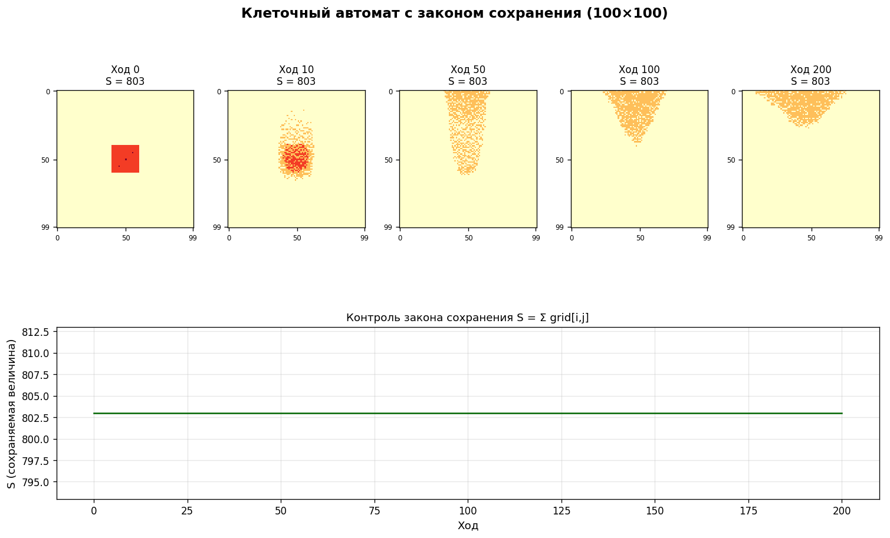

# Клеточный автомат с законом сохранения

Творческое задание №2 по дисциплине «Машинное обучение»



## Задача

Построить клеточный автомат, в котором сохраняется заданная величина. Окрестность, множество состояний и граничные условия выбираются самостоятельно

## Решение

Состояния 0-3 трактуются как количество вещества в клетке, сохраняется их сумма по полю. Клетка, в которой больше среднего по окрестности фон Неймана, передаёт одну единицу самому бедному соседу. Каждая операция это пара (−1, +1), так что сумма не меняется. Клетки обходятся в случайном, но воспроизводимом порядке

## Результат

Плотный квадрат в центре за 200 ходов расползается в пятно, сумма S = 803 держится на всех шагах

## Запуск

```bash
python cellular_automaton_conservation.py
```

Отчёт: [report.docx](report.docx)
