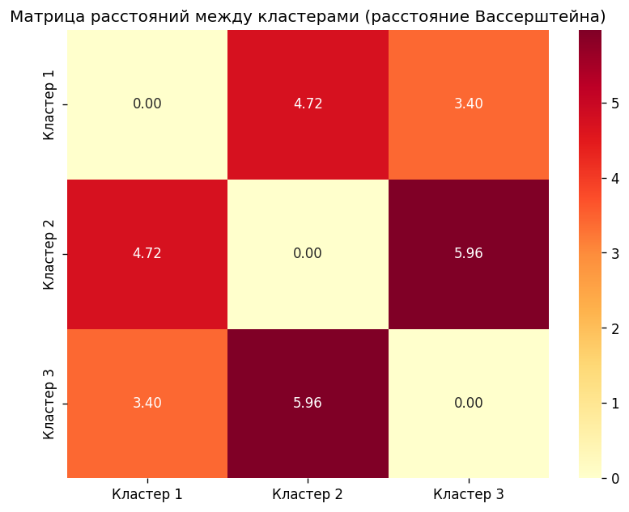

# Расстояние Вассерштейна между кластерами

Контрольная работа №2 по дисциплине «Машинное обучение»



## Задача

Даны n кластеров, каждый описывает нормально распределённый вектор. Параметры распределения оцениваются по точкам кластера. Построить матрицу расстояний между кластерами

## Решение

Для двух нормальных распределений расстояние Вассерштейна считается в явном виде: W² = ‖μ₁ − μ₂‖² + tr(Σ₁ + Σ₂ − 2(Σ₁^½ Σ₂ Σ₁^½)^½). Кластеры трёхмерные, для картинки они проецируются через PCA

## Результат

Для трёх сгенерированных кластеров ближе всего первый и третий (3.40), дальше всего второй и третий (5.96)

## Запуск

```bash
python cluster_distance_wasserstein.py
```

Отчёт: [report.docx](report.docx)
