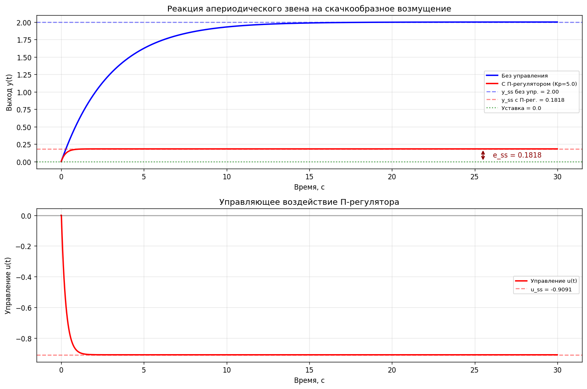

# Апериодическое звено и П-регулятор

Обязательное задание №3, вариант b по дисциплине «Машинное обучение»



## Задача

Рассчитать реакцию звена W(s) = K/(Ts + 1) на скачок возмущения без управления и с пропорциональным регулятором, оценить стационарную ошибку

## Решение

Уравнение T·y' + y = K(u + d) интегрируется методом Эйлера, результат сверяется с аналитическим решением. Для замкнутой системы y_ss = K·d/(1 + K·Kp)

## Результат

При K = 2, T = 3, Kp = 5 без управления выход уходит на 2.0, с регулятором на 0.18. Остаточная ошибка 0.18 и есть известное свойство П-регулятора: полностью подавить постоянное возмущение он не может, для этого нужна интегральная составляющая

## Запуск

```bash
python first_order_system_control.py
```

Отчёт: [report.docx](report.docx)
