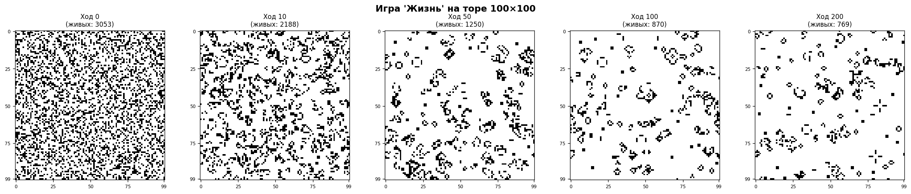

# Игра «Жизнь» на торе

Обязательное задание №2, вариант a по дисциплине «Машинное обучение»



## Задача

Реализовать «Жизнь» Конвея на поле 100×100 со склеенными краями. Программа прогоняет заданное число ходов, останавливается при выходе на устойчивое состояние и показывает поле на выбранных ходах

## Решение

Соседи считаются сдвигами `np.roll`, что и даёт тороидальную топологию. Устойчивым считается состояние, которое не меняется или повторяется через ход

## Результат

Со случайного старта с плотностью 30% за 1 000 ходов поле так и не успокаивается: число живых клеток гуляет между 550 и 900. На торе планеры летают бесконечно, а их период по полю 100×100 намного больше двух ходов

## Запуск

```bash
python game_of_life_torus.py
```

Отчёт: [report.docx](report.docx)
