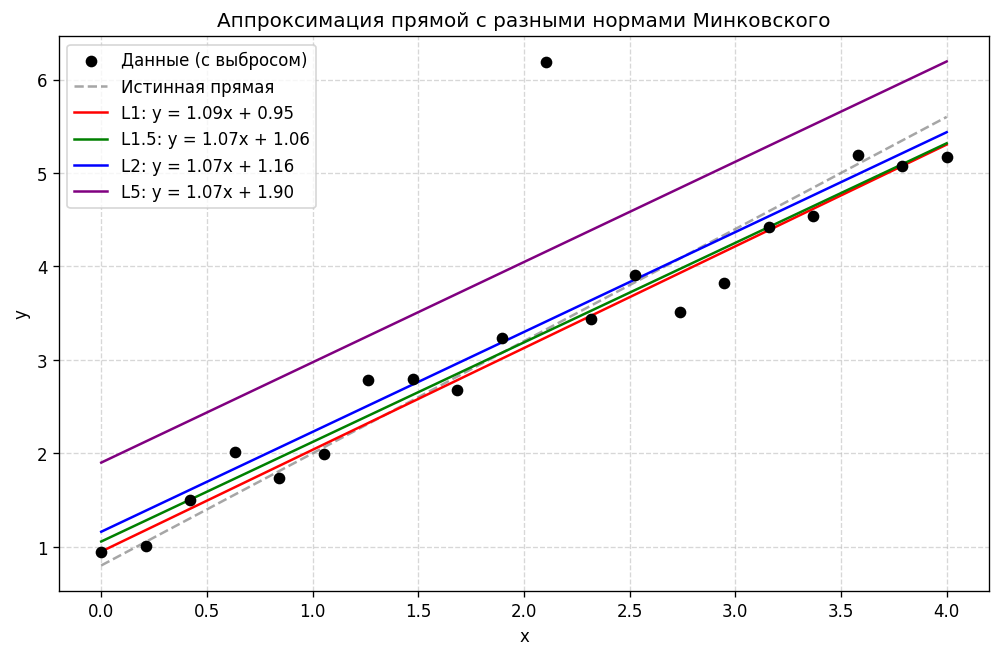

# Аппроксимация прямой по норме Минковского

Контрольная работа №3 по дисциплине «Машинное обучение»



## Задача

Найти прямую, которая минимизирует невязку Σ|yᵢ − (axᵢ + b)|ᵖ при произвольной степени p. Сравнить, как разные p ведут себя на данных с выбросом

## Решение

Прямая подбирается численно через `scipy.optimize.minimize`, стартуя с обычного МНК-решения. Для p ≤ 1 функция потерь негладкая, поэтому там используется безградиентный Nelder-Mead

## Результат

Чем меньше p, тем слабее прямую тянет к выбросу. При p = 1 свободный член 0.95, при p = 5 уже 1.90, хотя истинное значение 0.8

## Запуск

```bash
python minkowski_norm_fitting.py
```

Отчёт: [report.docx](report.docx)
