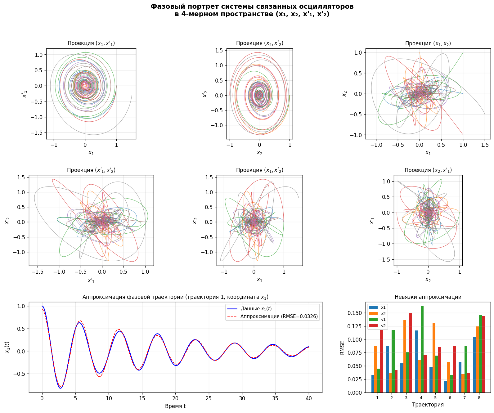

# Фазовый портрет в 4D: связанные осцилляторы

Творческое задание №5 по дисциплине «Машинное обучение»



## Задача

Построить фазовый портрет в 2n-мерном пространстве координат и скоростей по набору данных и аппроксимировать траектории аналитическими функциями с оценкой невязки

## Решение

Модель это два затухающих осциллятора с упругой связью, фазовое пространство четырёхмерное. Траектории из восьми начальных условий показаны шестью двумерными проекциями. Каждая координата аппроксимируется затухающей косинусоидой A·e^(−αt)·cos(ωt + φ) + C

## Результат

Средняя невязка 0.083, максимальная 0.16. Одночастотная модель описывает траектории грубо: в связанной системе две собственные частоты, и там, где заметны биения, ошибка, по-видимому, выше

## Запуск

```bash
python phase_portrait_coupled_oscillators.py
```

Отчёт: [report.docx](report.docx)
