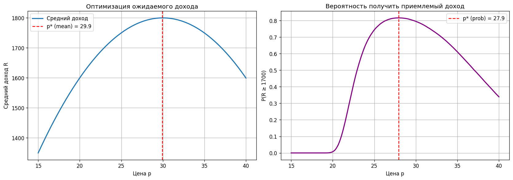

# Цена при случайном спросе

Обязательное задание №3, вариант a по дисциплине «Машинное обучение»



## Задача

Спрос q(p) = (q₀ + a) − b(p − p₀), где a и b это случайные возмущения от действий конкурентов. Выбрать цену, чтобы (1) максимизировать средний доход и (2) с максимальной вероятностью получить приемлемый доход

## Решение

Для средней выручки оптимум находится аналитически: p* = (q₀ + E[b]·p₀) / (2E[b]). Вероятность дохода не ниже порога оценивается симуляцией на 100 000 реализаций a и b по сетке цен

## Результат

Оптимум по среднему доходу p* = 30. Если важнее гарантированно получить хотя бы 1 700, цена ниже, около 27.9: так доход меньше зависит от того, насколько сильно конкуренты «продавят» спрос

## Запуск

```bash
python pricing_under_uncertainty.py
```

Отчёт: [report.docx](report.docx)
