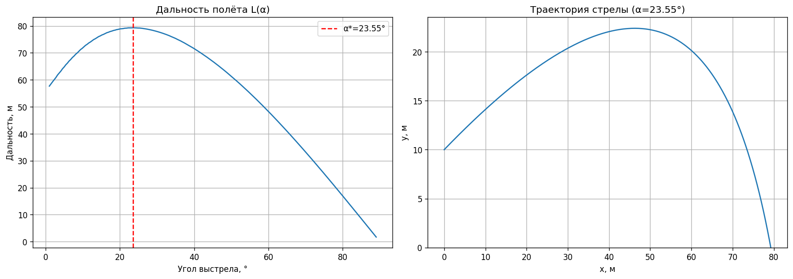

# Оптимальный угол выстрела с сопротивлением воздуха

Обязательное задание №4, вариант a по дисциплине «Машинное обучение»



## Задача

Робин Гуд стреляет на дальность. Известны начальная скорость стрелы, высота, с которой он стреляет, и коэффициент сопротивления, пропорционального скорости. Найти максимальную дальность

## Решение

При линейном сопротивлении уравнения движения решаются в явном виде. Для каждого угла ищется момент падения, по нему считается дальность, и перебором находится лучший угол

## Результат

При v₀ = 50 м/с и k = 0.5 с⁻¹ лучший угол 23.6°, дальность 79.3 м. Без сопротивления оптимум был бы чуть меньше 45°, сопротивление сильно сдвигает его вниз

## Запуск

```bash
python projectile_motion_drag.py
```

Отчёт: [report.docx](report.docx)
