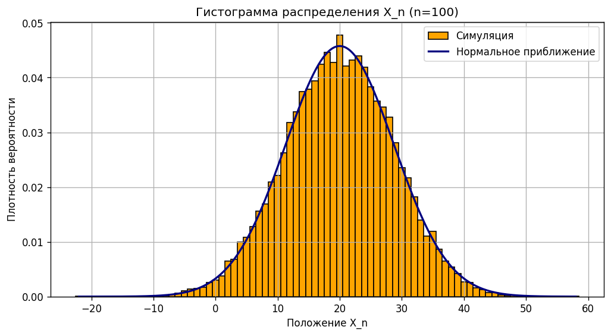

# Распределение случайного блуждания

Обязательное задание №1, вариант a по дисциплине «Машинное обучение»



## Задача

Объект стартует в нуле и на каждом шаге остаётся на месте с вероятностью p₀, сдвигается влево с p₁ и вправо с p₂. Найти математическое ожидание и дисперсию положения через n шагов

## Решение

Шаг принимает значения 0, −1, +1, шаги независимы. Отсюда E[Xₙ] = n(p₂ − p₁) и Var(Xₙ) = n((p₁ + p₂) − (p₂ − p₁)²). Для проверки 20 000 симуляций

## Результат

При p₀ = 0.2, p₁ = 0.3, p₂ = 0.5 и n = 100 теория даёт E = 20 и Var = 76, симуляция 19.94 и 76.07. На гистограмме видно, что распределение уже близко к нормальному

## Запуск

```bash
python random_walk_distribution.py
```

Отчёт: [report.docx](report.docx)
