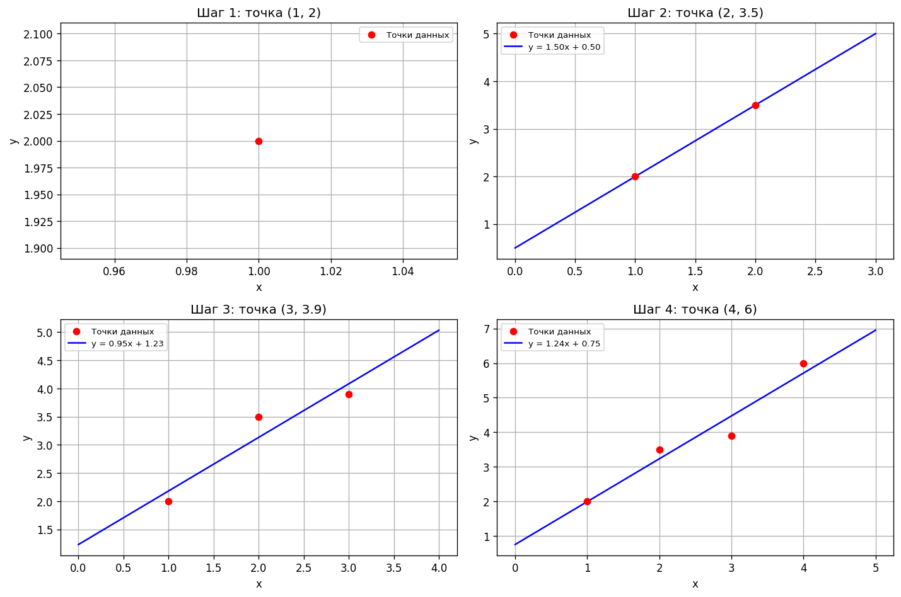

# Рекуррентный МНК

Контрольная работа №1 по дисциплине «Машинное обучение»



## Задача

Точки (x, y) приходят по одной. После каждой новой точки нужно уточнить аппроксимирующую прямую, не пересчитывая всё заново

## Решение

Для прямой y = ax + b метод наименьших квадратов зависит только от четырёх сумм: Σx, Σy, Σx², Σxy и числа точек. Их можно накапливать, и тогда каждая новая точка обходится в O(1), а коэффициенты считаются по готовым формулам

## Результат

На четырёх точках прямая сходится к y = 1.24x + 0.75, прогноз для x = 5 равен 6.95. На первом шаге точка одна, и прямая ещё не определена

## Запуск

```bash
python recursive_least_squares.py
```

Отчёт: [report.docx](report.docx)
