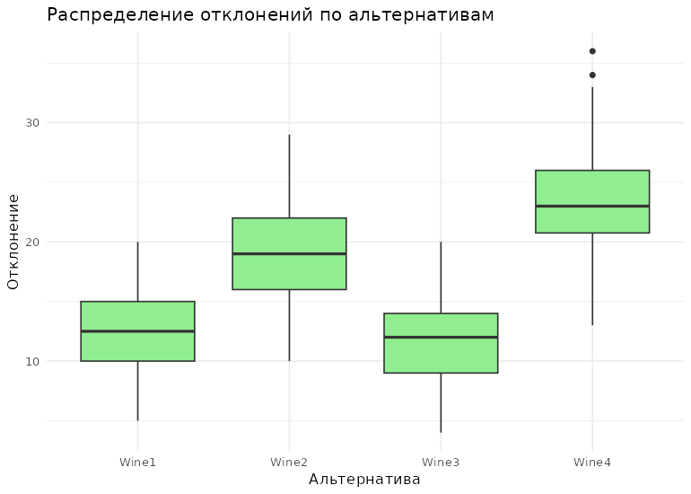
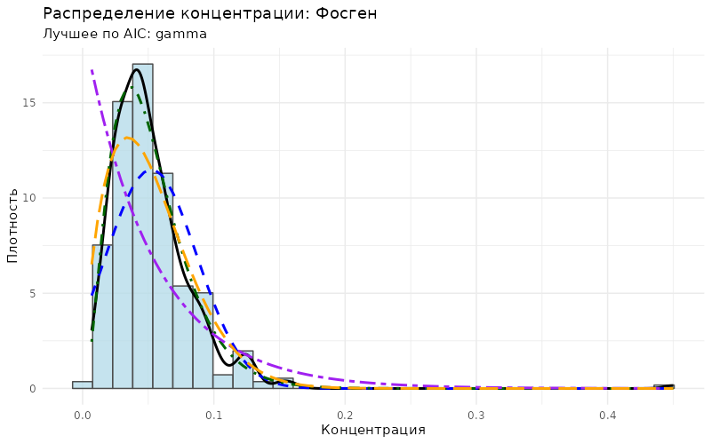

# Лабораторные по R

Три лабораторные по дисциплине «Программирование на языке R», 2 курс (2025). Задачи разные: описательная статистика по опросу, подбор распределений с оценкой рисков и линейная регрессия

Исходные данные были привязаны к варианту задания, поэтому в каждой папке есть генератор синтетических данных той же структуры. Скрипты запускаются из папки лабораторной и сами создают данные, если их нет

## Лаба 1. Метод идеальной точки

Маркетинговый опрос: респонденты оценивают идеальное вино и четыре реальных по 10 характеристикам. Для каждой альтернативы считается суммарное отклонение от идеала каждого респондента, дальше описательная статистика этих отклонений: центр, разброс, асимметрия, эксцесс. Отдельно описывается сам идеал с доверительными интервалами для средних



## Лаба 2. Очистные сооружения или штрафы

Предприятие выбрасывает пять веществ. Для каждого нужно решить, что выгоднее за пять лет: поставить очистное оборудование или платить штрафы, если превышение ПДК заметят

Порядок такой: выбросы в концентрациях убираются тестом Граббса, затем по AIC выбирается лучшее из четырёх распределений (нормальное, гамма, экспоненциальное, Вейбулла). Вероятность превышения ПДК сначала считается для самого неблагоприятного ветра, и вещества, по которым даже этот сценарий дешевле очистки, отсеиваются. Для остальных вероятность штрафа считается по формуле полной вероятности с учётом розы ветров



На синтетических данных очистку стоит ставить для фосгена и диоксина, по остальным веществам штрафы обходятся дешевле

## Лаба 3. Регрессия индекса счастья

По социально-экономическим показателям сообществ предсказывается ощущаемый уровень счастья. Из 13 «признаков состояния» берутся 5 сильнее всего коррелирующих с целевой переменной, к ним добавляются 10 «причинных». Модель линейная, выборка делится 80/20

Скорректированный R² на валидации 0.92 на данных варианта и 0.93 на синтетических. Важность признаков оценивается по стандартизованным коэффициентам, иначе доход в тысячах и индексы от 0 до 1 не сравнить


## Запуск

```r
setwd("lab2-emission-risk-analysis")
source("emission_risk_analysis.R", encoding = "UTF-8")
```

Недостающие пакеты скрипты установят сами. Нужны dplyr, ggplot2, openxlsx, readxl, reshape2, moments, outliers и MASS. Отчёты в Word лежат в папке каждой лабораторной (`report.docx`)
