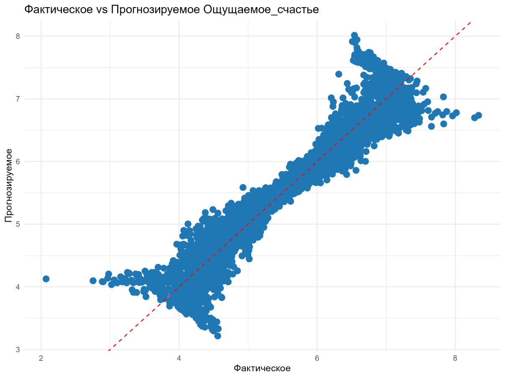

# R Labs Collection

Три лабораторные работы по дисциплине «Программирование на языке R» (2 курс, «Прикладная информатика», профиль «Анализ данных»). Разные задачи, разные методы — объединены в один репозиторий, потому что курс один и тот же.

## Содержание

| Лаба | Тема | Методы |
|---|---|---|
| [lab1](./lab1-ideal-point-analysis) | Анализ опроса методом идеальной точки (маркетинг, 4 альтернативы вина) | описательная статистика, отклонения от идеала, асимметрия/эксцесс |
| [lab2](./lab2-emission-risk-analysis) | Затраты на очистные сооружения vs риск штрафов за выбросы | тест Граббса, подбор теоретического распределения (нормальное/гамма/экспоненциальное/Вейбулла) по AIC, вероятностный расчёт с учётом розы ветров |
| [lab3](./lab3-happiness-regression) | Прогноз индекса счастья по социально-экономическим показателям | линейная регрессия, отбор признаков по корреляции, train/valid split |

Каждая папка самодостаточна: R-скрипт + отчёт (docx) с постановкой задачи, ходом работы и выводами.

## Лаба 1 — метод идеальной точки

Дано: результаты маркетингового опроса, где респонденты оценивали идеальный продукт и 4 реальные альтернативы по 10 характеристикам. Задача — понять, какая альтернатива ближе всего к идеалу, и описать сам идеал статистически (среднее, медиана, мода, вариация, асимметрия).

## Лаба 2 — очистные сооружения или штрафы

Дано: производство с выбросами нескольких вредных веществ, справочник ПДК и штрафов, роза ветров. Задача — для каждого вещества оценить, что выгоднее: поставить очистное оборудование или платить штрафы, если превышение обнаружат. Для этого сначала чистим выбросы (тест Граббса), затем подбираем теоретическое распределение концентраций по AIC, и на его основе считаем вероятность превышения ПДК при разных направлениях ветра.

## Лаба 3 — регрессия индекса счастья

Дано: показатели по сообществам (доход, продолжительность жизни, соцподдержка, коррупция и т.д.). Задача — линейной регрессией предсказать субъективный уровень счастья, отобрав пять сильнее всего коррелирующих «состояний» и добавив к ним десять «причинных» переменных. Скорректированный R² на валидации — 0.92.

## Стек

R, dplyr, ggplot2, moments, EnvStats, outliers, openxlsx, readxl
