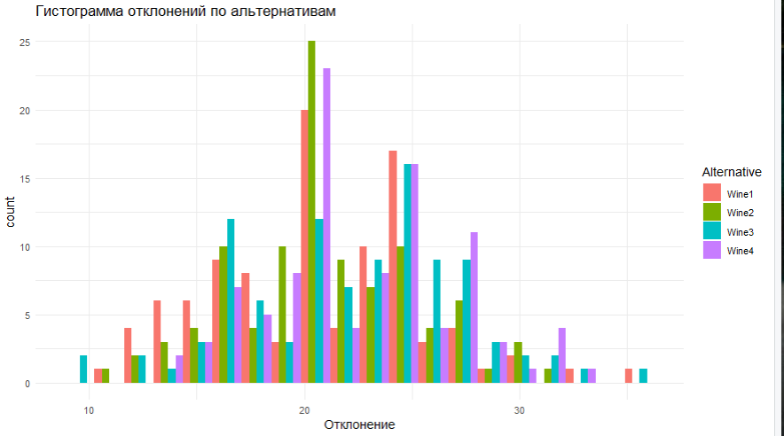
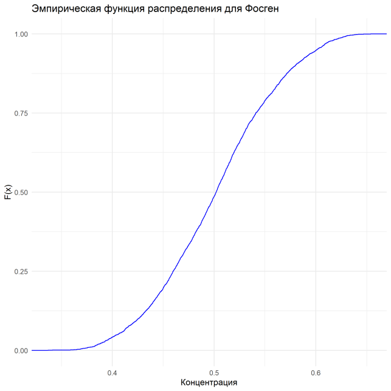
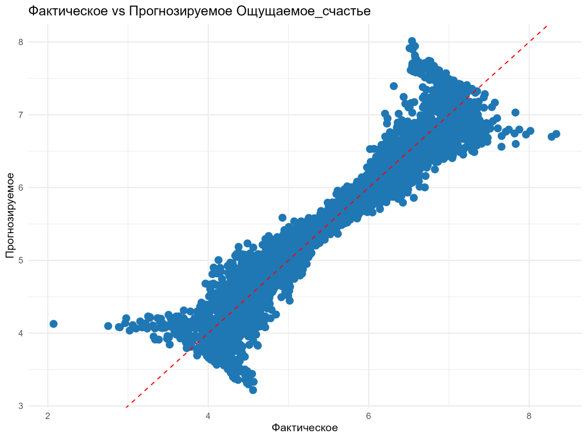

# R Programming Labs

Три лабораторные работы по дисциплине «Программирование на языке R» (2 курс, «Прикладная информатика», профиль «Анализ данных»). Разные задачи, разные методы — объединены в один репозиторий, потому что курс один и тот же.

## Содержание

| Лаба | Тема | Методы |
|---|---|---|
| [lab1](./lab1-ideal-point-analysis) | Анализ опроса методом идеальной точки (маркетинг, 4 альтернативы вина) | описательная статистика, отклонения от идеала, асимметрия/эксцесс |
| [lab2](./lab2-emission-risk-analysis) | Затраты на очистные сооружения vs риск штрафов за выбросы | тест Граббса, подбор теоретического распределения (нормальное/гамма/экспоненциальное/Вейбулла) по AIC, вероятностный расчёт с учётом розы ветров |
| [lab3](./lab3-happiness-regression) | Прогноз индекса счастья по социально-экономическим показателям | линейная регрессия, отбор признаков по корреляции, train/valid split |

Каждая папка самодостаточна: R-скрипт + отчёт (docx) с постановкой задачи, ходом работы и выводами.

## Лаба 1 — метод идеальной точки

Дано: результаты маркетингового опроса, где респонденты оценивали идеальный продукт и 4 реальные альтернативы по 10 характеристикам. Задача — понять, какая альтернатива ближе всего к идеалу, и описать сам идеал статистически (среднее, медиана, мода, вариация, асимметрия).



## Лаба 2 — очистные сооружения или штрафы

Дано: производство с выбросами нескольких вредных веществ, справочник ПДК и штрафов, роза ветров. Задача — для каждого вещества оценить, что выгоднее: поставить очистное оборудование или платить штрафы, если превышение обнаружат. Для этого сначала чистим выбросы (тест Граббса), затем подбираем теоретическое распределение концентраций по AIC, и на его основе считаем вероятность превышения ПДК при разных направлениях ветра.



## Лаба 3 — регрессия индекса счастья

Дано: показатели по сообществам (доход, продолжительность жизни, соцподдержка, коррупция и т.д.). Задача — линейной регрессией предсказать субъективный уровень счастья, отобрав пять сильнее всего коррелирующих «состояний» и добавив к ним десять «причинных» переменных. Скорректированный R² на валидации — 0.92.



## Данные

Файлы с исходными данными (`.xlsx`/`.RData`) в репозиторий не включены — они завязаны на конкретный вариант задания курса (у меня вариант 26), выданный по фамилии, а не датасеты открытого доступа. В каждой папке лабы лежит `data/README.md` с именем файла, который туда нужно положить, чтобы скрипт заработал.

## Как запустить

```r
# из папки конкретной лабы, например lab3-happiness-regression/
source("happiness_regression.R")
```

Все скрипты сами ставят недостающие пакеты при первом запуске (`install.packages`, если пакета ещё нет).

## Что стоит иметь в виду

- В лабе 2 тест Граббса на выбросы прогоняется один раз на столбец, а не итеративно — если в данных больше одного выброса, часть из них останется. Для учебной задачи этого достаточно, для продакшена — нет.
- В лабе 3 из 13 «состояний» в модель берутся только 5 с наибольшей корреляцией, остальные восемь отбрасываются без проверки на мультиколлинеарность между отобранными и «причинными» переменными — при большом количестве наблюдений (судя по графику, это тысячи точек) это не критично, но в отчёте это не обсуждается.
- Мода в лабе 1 считается для непрерывных величин (отклонений от идеала) — с методической точки зрения это спорно: мода как статистика имеет смысл для дискретных/сгруппированных данных, для непрерывных она обычно эквивалентна «самому частому значению с точностью до знаков после запятой», что мало информативно. Оставил как в задании, но при разборе с преподавателем это хороший повод для вопроса.

## Стек

R, dplyr, ggplot2, moments, EnvStats, outliers, openxlsx, readxl.
