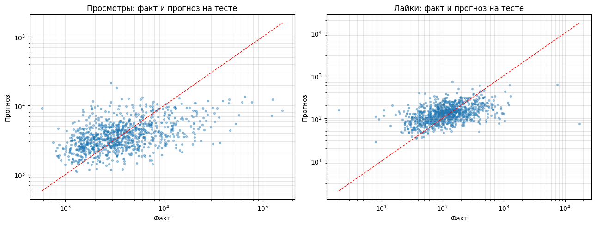
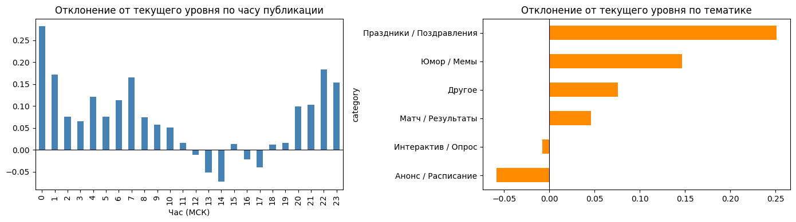

# Прогноз вовлечённости постов ВКонтакте

Индивидуальный цифровой проект, 2 курс (2025). Можно ли по тексту поста и времени публикации заранее понять, сколько он наберёт просмотров и лайков? Данные взяты со стены спортивного сообщества, которое автор ведёт: 9 000 постов с 2012 по 2025 год, собранных через VK API



## Результат

Проверка идёт по времени: обучение на постах до апреля 2023, тест на последующих двух годах. Главная сложность в том, что сообщество всё время растёт, и медианный охват поста за эти годы вырос почти вдвое

| | R² (log) | MAE | медианная ошибка |
|---|---|---|---|
| Просмотры, уровень последних 20 постов | 0.12 | 3 660 | 45.7% |
| **Просмотры, итоговая модель** | **0.22** | **3 535** | **45.5%** |
| Лайки, уровень последних 20 постов | −0.05 | 124 | 52.8% |
| **Лайки, итоговая модель** | **0.19** | **113** | **47.0%** |

Цифры скромные, и это ожидаемо: судьбу поста в ленте во многом решают алгоритм VK и инфоповод, которых в данных нет. Но модель стабильно лучше наивного правила «будет как обычно», а по лайкам разница заметная. MAE тянут вверх несколько вирусных постов, поэтому основная метрика здесь R² в логарифме

Из интересного в весах модели: флаги и эмодзи мяча в тексте поднимают охват, а регулярные «обзоры» матчей его опускают. Посты, выложенные поздно вечером и ночью, в среднем набирают больше обычного, дневные в районе 13-14 часов меньше



## Как устроена модель

**прогноз = текущий уровень сообщества + поправка**

Текущий уровень считается как медиана log-просмотров (или лайков) 20 предыдущих постов. Это известно до публикации и снимает проблему роста аудитории. Поправку предсказывает Ridge-регрессия по признакам самого поста:

- текст через TF-IDF по символьным n-граммам от 2 до 5 символов. Для русского с его падежами, хештегами и эмодзи это работает лучше, чем целые слова
- длина, число слов, эмодзи, хештеги, ссылки, счёт матча вида «2:1», восклицательные знаки
- час и день недели по Москве
- темп постинга: сколько часов прошло с прошлого поста и сколько постов вышло за сутки

Силу регуляризации подбирали на последних 20% обучающей выборки, тестовые данные в подборе не участвовали

## Ограничения

- Посты до 2017 года не используются: VK тогда ещё не считал просмотры, и в выгрузке у них стоят нули
- Число комментариев в модель не входит, хотя с просмотрами оно заметно связано (ранговая корреляция 0.44): до публикации его не знает никто
- Тип вложений (фото, видео, опрос) в выгрузке не сохранялся, а он наверняка влияет на охват. Это первое, что стоит добавить при следующем сборе данных

## Запуск

```bash
pip install -r requirements.txt

# прогноз для нового поста
python predict.py --text "Победа 2:1! Поздравляем команду ⚽" --when "2025-08-10 21:00"
```

```
Тематика по словарю: Матч / Результаты
Длина текста: 33 символов, эмодзи: 1
Просмотры: ~12 580 (обычный уровень сейчас ~7 767)
Лайки: ~452 (обычный уровень сейчас ~187)
```

Чтобы пересобрать всё с нуля, ноутбуки из `pipeline/` запускаются по порядку. Первый нужен, только если хочется собрать свежие данные: для него понадобится `.env` с токеном и id сообщества (шаблон в `.env.example`). Выгрузка уже лежит в `data/vk_posts_raw.xlsx`

## Структура

```
vk-engagement-prediction/
├── pipeline/
│   ├── 01_collect_data.ipynb     сбор постов через wall.get
│   ├── 02_prepare_data.ipynb     фильтрация, признаки, разведочные графики
│   ├── 03_train_model.ipynb      обучение и оценка
│   └── features.py               общие функции признаков
├── experiments/                  побочные исследования, в модель не вошли
│   ├── eda_correlations.ipynb
│   ├── clustering_and_sentiment.ipynb   K-Means по постам
│   ├── classification_attempt.ipynb     постановка как «выше или ниже медианы»
│   └── bi_export.ipynb                  выгрузка для Power BI
├── data/
├── models/engagement_model.joblib
├── images/
├── reports/                      отчёт, презентация, список литературы
└── predict.py
```

Стек: Python, pandas, scikit-learn, requests, matplotlib, seaborn
